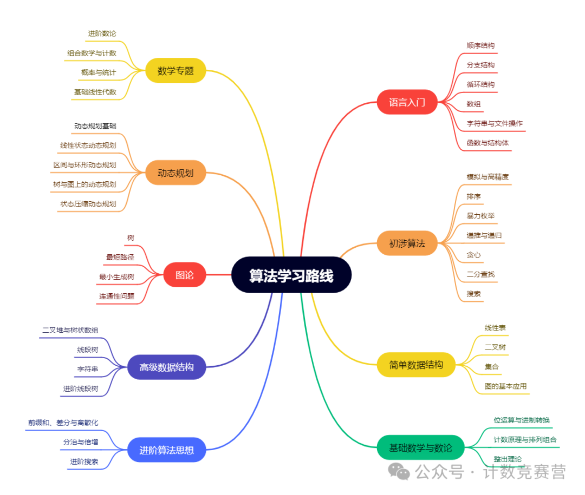

---
hide:
  - navigation
  - toc
---

 

# 更多学习资源

手把手带你刷题： [oj.ayxy.edu.cn](oj.ayxy.edu.cn)

详细题解：[https://algogo.readthedocs.io/zh-cn/latest/](https://algogo.readthedocs.io/zh-cn/latest/)

数据结构与算法学习： [https://data-structure.readthedocs.io/zh-cn/latest/](https://data-structure.readthedocs.io/zh-cn/latest/)

B站视频讲解：[https://space.bilibili.com/3546565704682160](https://space.bilibili.com/3546565704682160)
